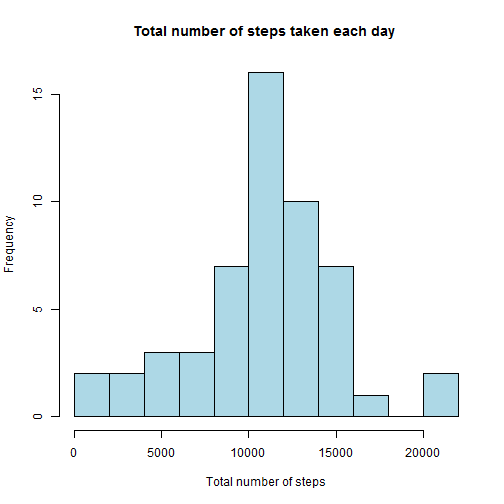
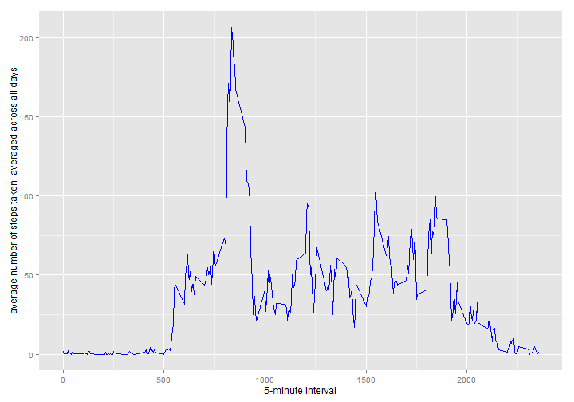

Data was collected from a personal activity monitoring device,
This device collects data at 5 minute intervals through out the day. 
The data consists of two months of data from an anonymous individual collected during
the months of October and November, 2012 and include the number of steps taken in 5
minute intervals each day.
Dataset : <https://d396qusza40orc.cloudfront.net/repdata%2Fdata%2Factivity.zip>
Downloaded : March 09, 2015


```r
knitr::opts_chunk$set(echo=TRUE, warning=TRUE, message=TRUE)
library(impute)
library(ggplot2)
library(xtable)
library(lubridate)
library(plyr)
```

### Load and Examine the dataset

```r
if (!file.exists("activity.csv")) {
        url <- "http://d396qusza40orc.cloudfront.net/repdata%2Fdata%2Factivity.zip"
        download.file(url, dest="activity.zip", mode="wb")
        unzip("activity.zip", "activity.csv")
}
activity <- read.csv("activity.csv")
str(activity)
```

```
## 'data.frame':	17568 obs. of  3 variables:
##  $ steps   : int  NA NA NA NA NA NA NA NA NA NA ...
##  $ date    : Factor w/ 61 levels "2012-10-01","2012-10-02",..: 1 1 1 1 1 1 1 1 1 1 ...
##  $ interval: int  0 5 10 15 20 25 30 35 40 45 ...
```

```r
dim(activity)
```

```
## [1] 17568     3
```

```r
summary(activity)
```

```
##      steps                date          interval     
##  Min.   :  0.00   2012-10-01:  288   Min.   :   0.0  
##  1st Qu.:  0.00   2012-10-02:  288   1st Qu.: 588.8  
##  Median :  0.00   2012-10-03:  288   Median :1177.5  
##  Mean   : 37.38   2012-10-04:  288   Mean   :1177.5  
##  3rd Qu.: 12.00   2012-10-05:  288   3rd Qu.:1766.2  
##  Max.   :806.00   2012-10-06:  288   Max.   :2355.0  
##  NA's   :2304     (Other)   :15840
```

Function for calculate mean, median, and plot histogram, plot time series

```r
cal_mean_median <- function(a, extra_message="") {
        mean_steps <- mean(a, na.rm=TRUE)
        median_steps <- median(a, na.rm=TRUE)
        noquote(paste("Mean is", round(mean_steps, digits=4), ", and the Median is", 
                        round(median_steps, digits=4), 
                        "of the total number of steps taken per day", extra_message, sep=" "))
        }

plot_hist <- function(a, extra_message="") {
        title = paste("Total number of steps taken each day", extra_message, sep = " ")
        hist(a, breaks=10, xlab=c("Total number of steps"), main=title, col="light blue")
        }

plot_ts <- function(tablename, extra_message="", groupby=NULL) {
        title = paste("Average # of steps taken in 5-minute interval, averaged across all", extra_message,
                      "\nfrom 1 Oct - 30 Nov 2012", sep=" ")
        ##meanstep_ts <- ts(tablename[order(tablename$interval),]$x)
        ##plot.ts(meanstep_ts, col="blue", xlab=c("5-minute interval"), ylab="average number of steps taken", main=title)
        meanstep_ts <- tablename[order(tablename$interval),]
        if (is.null(groupby)) {
                g <- ggplot(meanstep_ts, aes(x=interval, y=x)) + geom_line(color="blue") 
        } else {
                g <- ggplot(meanstep_ts, aes(x=interval, y=x, group=Group.2)) 
                g <- g + geom_line(aes(x=interval, y=x, color=Group.2)) + facet_wrap(~Group.2, nrow=2)
                }
        g + xlab("5-minute interval") + ylab("average number of steps taken, averaged across all days")
        }
```
### What is mean total number of steps taken per day?

1. The total number of steps taken per day

```r
totalsteps <- aggregate(activity$steps, list(date=activity$date), sum)
```

2. Histogram of the total number of steps taken each day

```r
plot_hist(totalsteps$x)
```

 

```r
png(filename = "hist_totalsteps.png", width = 480, height = 480, units = "px")
plot_hist(totalsteps$x)
dev.off()
```

```
## png 
##   2
```

3. The mean and median of the total number of steps taken per day

```r
cal_mean_median(totalsteps$x)
```

```
## [1] Mean is 10766.1887 , and the Median is 10765 of the total number of steps taken per day
```

### What is the average daily activity pattern?

1. Time series plot of the 5-minute interval and the average number of steps taken, averaged across all days.

```r
meanstep_interval <- aggregate(activity$steps, list(interval=activity$interval), mean, na.rm=TRUE)
plot_ts(meanstep_interval, "day")
```

 

```r
png(filename = "ts_meanstep_interval.png", width = 480, height = 480, units = "px")
plot_ts(meanstep_interval, "day")
dev.off()
```

```
## png 
##   2
```

2. Which 5-minute interval, on average across all the days in the dataset, contains the maximum number of steps?

```r
max_steps_interval <- meanstep_interval[which.max(meanstep_interval$x),]$interval
noquote(paste("Interval", max_steps_interval, "has the max # of steps, on average across all the days", sep=" "))
```

```
## [1] Interval 835 has the max # of steps, on average across all the days
```

### Impute missing values

1. The number of missing values in the dataset

```r
missing_value <- !complete.cases(activity)
noquote(paste("The total number of missing values in the dataset = ", nrow(activity[missing_value,]), sep=" "))
```

```
## [1] The total number of missing values in the dataset =  2304
```

2. Strategy for filling in all of the missing values in the dataset 
        Replace all missing steps data with the mean value of that 5-minute interval
        Reference : Columbia University, Department of Statistic, Missing-data imputation\n
        <http://www.stat.columbia.edu/~gelman/arm/missing.pdf>

```r
impute_missing <- function(a, b) {
        ifelse(is.na(a), meanstep_interval[meanstep_interval$interval==b,]$x, a)
}
```

3. Create a new dataset that is equal to the orginal dataset but with the missing data filled in.

```r
activity_imputed <- activity
activity_imputed$steps <- impute_missing(activity_imputed$steps, activity_imputed$interval)
```

4. Histogram of the total number of steps taken each day 

```r
totalimputedsteps <- aggregate(activity_imputed$steps, list(date=activity_imputed$date), sum)
plot_hist(totalimputedsteps$x, "(includes imputed values for all the missing steps data)")
```

 

```r
png(filename = "hist_totalimputedsteps.png", width = 480, height = 480, units = "px")
plot_hist(totalimputedsteps$x, "(includes imputed values for all the missing steps data)")
dev.off()
```

```
## png 
##   2
```

Calculate the mean and median total number of steps taken per day.

```r
cal_mean_median(totalimputedsteps$x)
```

```
## [1] Mean is 10766.1887 , and the Median is 10765.5943 of the total number of steps taken per day
```

Do these values differ from the estimates from the first part of the assignment?

```r
cat("There is no differences in mean value from the estimates from the first part of the assignment,
      it is because we use the mean imputation method, but the is a sight difference from the median.")
```

```
## There is no differences in mean value from the estimates from the first part of the assignment,
##       it is because we use the mean imputation method, but the is a sight difference from the median.
```

What is the impact of imputing missing data on the estimates of the total daily number of steps?

```r
cat("Quoted from above reference paper, 
Mean imputation can protentially distorts the relationship between variables by pulling estimates 
of the correlation towards zero. But in our case it shows no real impact on our new estimates.")
```

```
## Quoted from above reference paper, 
## Mean imputation can protentially distorts the relationship between variables by pulling estimates 
## of the correlation towards zero. But in our case it shows no real impact on our new estimates.
```

### Are there differences inactivity patterns between weekdays and weekends?

1. Create a new factor variable in the dataset with two levels - "weekday" and "weekend"

```r
activity_imputed$wday <- as.factor(ifelse(wday(ymd(activity_imputed$date), label=T) %in% c("Sat", "Sun"), 
                                          "weekend", "weekday"))
```

2. Panel plot containing a time series plot of the 5-minute interval and the average number of steps taken, 
        average across all weekdays days or weekend days.

```r
meanstep_interval_imputed <- aggregate(activity_imputed$steps, list(interval=activity_imputed$interval, activity_imputed$wday), mean, na.rm=TRUE)
plot_ts(meanstep_interval_imputed, "day", "wday")
```

 

```r
png(filename = "ts_meanstep_interval_imputed.png", width = 480, height = 480, units = "px")
plot_ts(meanstep_interval_imputed, "day", "wday")
dev.off()
```

```
## png 
##   2
```
